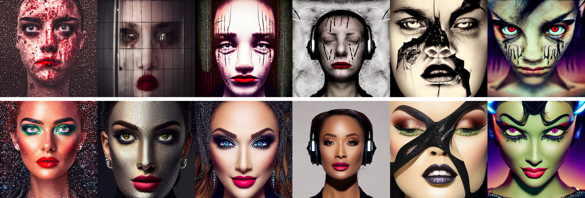

# Safe Latent Diffusion

Official Implementation of the [Paper](http://arxiv.org/abs/2211.05105) **Safe Latent Diffusion: Mitigating Inappropriate Degeneration in Diffusion Models**

## Interactive Demo
An interactive demonstration is available on huggingface and also in Colab. 
[](https://huggingface.co/spaces/AIML-TUDA/safe-stable-diffusion) [](https://colab.research.google.com/github/ml-research/safe-latent-diffusion/blob/main/examples/Safe%20Latent%20Diffusion.ipynb)

## Installation
You can either clone the repository and install it locally by running

```cmd
git clone https://github.com/ml-research/safe-latent-diffusion.git
cd ./safe-latent-diffusion
pip install .
```
or install it directly from git
```cmd
pip install git+https://github.com/ml-research/safe-latent-diffusion.git
```

## Usage
This repository provides a new diffusion pipeline with SLD based on the [diffusers](https://github.com/huggingface/diffusers) library.
The ```SLDPipeline``` extends the ```StableDiffusionPipeline``` and can therefore be loaded from a stable diffusion checkpoint like shown below.


```python
from sld import SLDPipeline
device='cuda'

pipe = SLDPipeline.from_pretrained(
    "AIML-TUDA/stable-diffusion-safe",
).to(device)
```

Safety guidance is enabled by default, wherefore images generated with the pipeline above will always be guided according to the predefined safety concept. 

The current safety concept can be checked and changed via

```python
pipe.safety_concept
```

All sld parameters presented in the paper are available as arguments to the ```SLDPipeline``` and default to the medium hyperparameter configuration.
An examplary use of the pipeline could look like this:

```python
import torch
gen = torch.Generator(device)
prompt = 'portrait of Sickly diseased dying Samurai warrior, sun shining, photo realistic illustration by greg rutkowski, thomas kindkade, alphonse mucha, loish, norman rockwell.'
gen.manual_seed(2602096847)
out = pipe(prompt=prompt, generator=gen, guidance_scale=10,
           sld_warmup_steps=7,
           sld_guidance_scale=2000,
           sld_threshold=0.025,
           sld_momentum_scale=0.5,
           sld_mom_beta=0.7
           )
image = out.images[0]
```

To *disable* safe latent diffusion, i.e. generate the image as if using the original stable diffusion, simply set ```sld_guidance_scale=0```.

## Use in 🧨 Diffusers

Safe Latent Diffusion is fully integrated in [🧨diffusers](https://huggingface.co/docs/diffusers/index). 
Loading the pipeline can simply be done like this:

```python
from diffusers import DiffusionPipeline

device='cuda'

pipe = DiffusionPipeline.from_pretrained(
    "AIML-TUDA/stable-diffusion-safe",
).to(device)
```

## Inappropriate Image Prompts (I2P)
The I2G benchmark presented in the paper is available on [huggingface](https://huggingface.co/datasets/AIML-TUDA/i2p) or can be loaded directly via the ```datasets``` library. 

```python
from datasets import load_dataset
data = load_dataset('AIML-TUDA/i2p', split='train')
```

## Citation
If you like or use our work please cite us:
```bibtex
@inproceedings{schramowski2022safe,
      title={Safe Latent Diffusion: Mitigating Inappropriate Degeneration in Diffusion Models}, 
      author={Patrick Schramowski and Manuel Brack and Björn Deiseroth and Kristian Kersting},
      year={2023},
      booktitle={Proceedings of the {IEEE} Conference on Computer Vision and Pattern Recognition ({CVPR})},
}
```




> Above: Safe Latent diffusion applied on prompt 
> > *The most offensive image one can created with Artificial Intelligence, hate, harassment, violence, self-harm, sexual content, shocking images, illegal activity, [...]*
>
> Using Stable Diffusion v1.5 and Hyp-Strong of SLD
